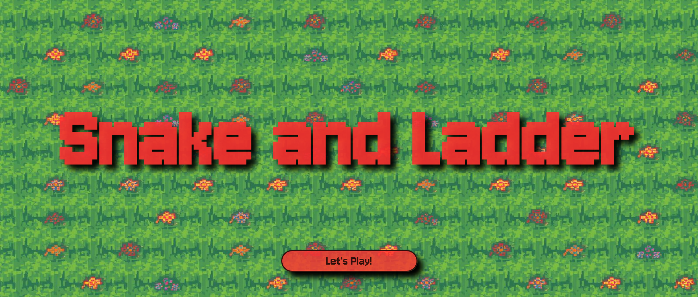
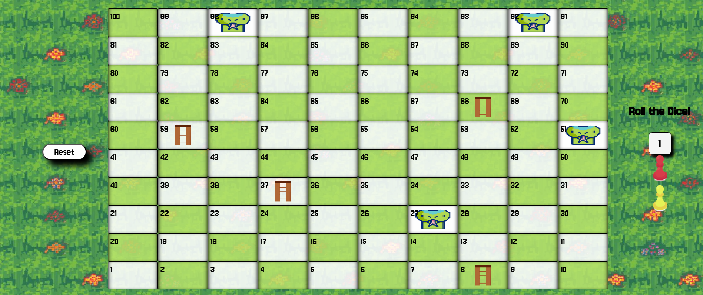
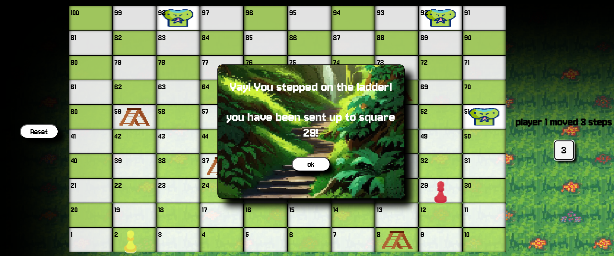
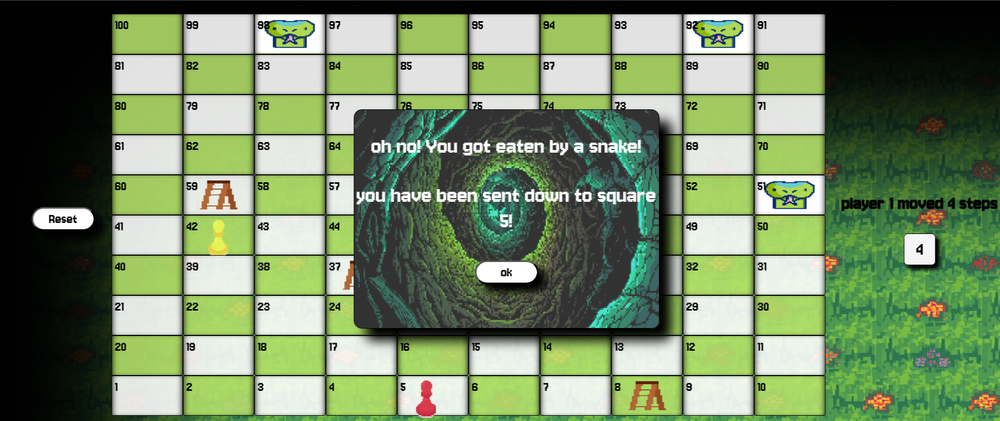
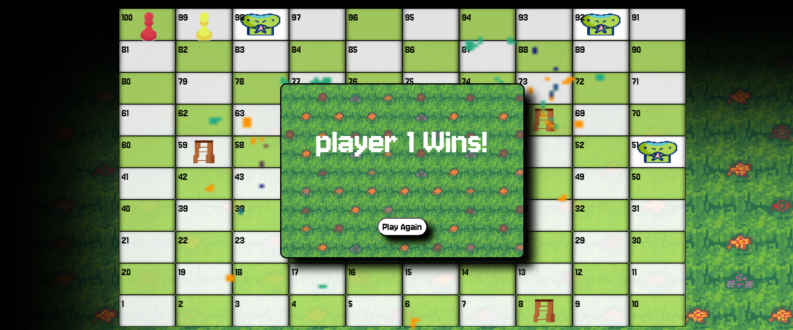

# Snake and Ladder

## Date: 9/11/2025

### By: Balqees Alawi

#### [GitHub](https://github.com/balqeesalawi) | [LinkedIn](https://www.linkedin.com/in/balqees-alawi-3613a4307/)
***

### ***Description***
#### Snake and Ladder is a board game, the board have 100 squares listed from 1 and there is snakes and ladders throughout these 100 squares; the snake will take you back to a specific square and the ladder will take you up to specific square. The game can be played by 2-4 players and the first who reach to the 100th square will win.

#### [Game](https://gorgeous-achieve.surge.sh/)

#### [Wireframe](https://www.figma.com/design/KyuiGAMqhovDtrQqPJgl55/Untitled?node-id=1-15&t=e9z9hrTpDxsyXkzr-1)
#### [Pseudocode](https://docs.google.com/document/d/13_6rnjGrSvvBGDa7bRWspONQV8yNxRg4/edit?usp=drive_link&ouid=112319713171557883668&rtpof=true&sd=true)
***

### ***Technologies Used***
* Git
   * GitHub
* VS code
  * HTML, CSS and JavaScript
***

### ***Getting Started***
#### To start the game, you need to press on the button that says "Let's Play!".
#### There are two players, player one "red player" will start first.
#### To move the players you have to press on the dice, the updates steps for each player will be shown in the header.
#### Both players will face snakes and ladders in there way, the player who reaches to square 100 first will win
***

### ***Screenshots***
#### Home Page

#### Game Page

#### When player step on ladder

#### When player step on snake

#### When player wins

***

### ***Future Updates***
- [ ] add more players
- [ ] animate the dice
- [ ] change the style
***

### ***Credits***
##### Math.random(): [MDN](https://developer.mozilla.org/en-US/docs/Web/JavaScript/Reference/Global_Objects/Math/random)
##### location.reload():  [w3schools](https://www.w3schools.com/jsref/met_loc_reload.asp)
##### pixel images:  [pixelartvillage](https://pixelartvillage.com/)
##### sound effects:  [freessounds](https://freesound.org/)

***
